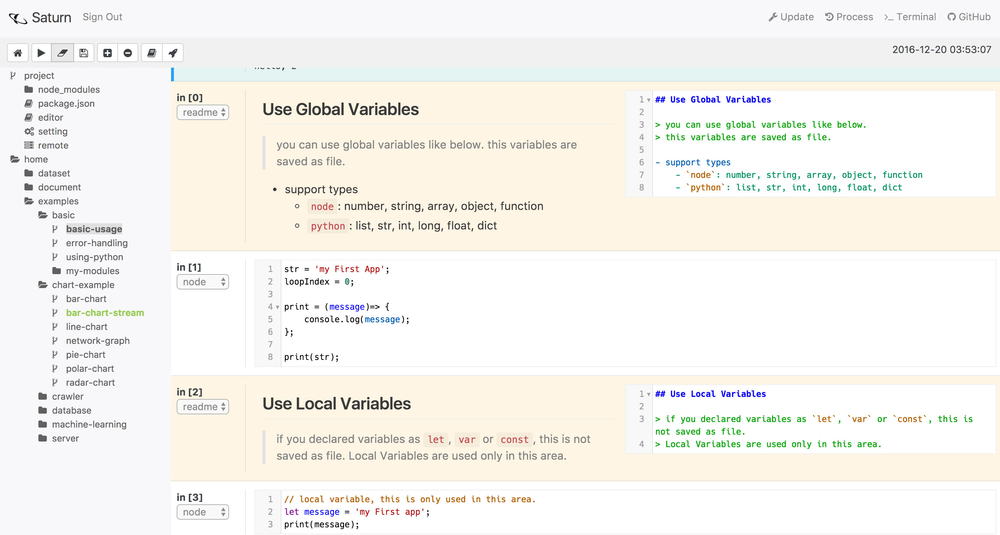
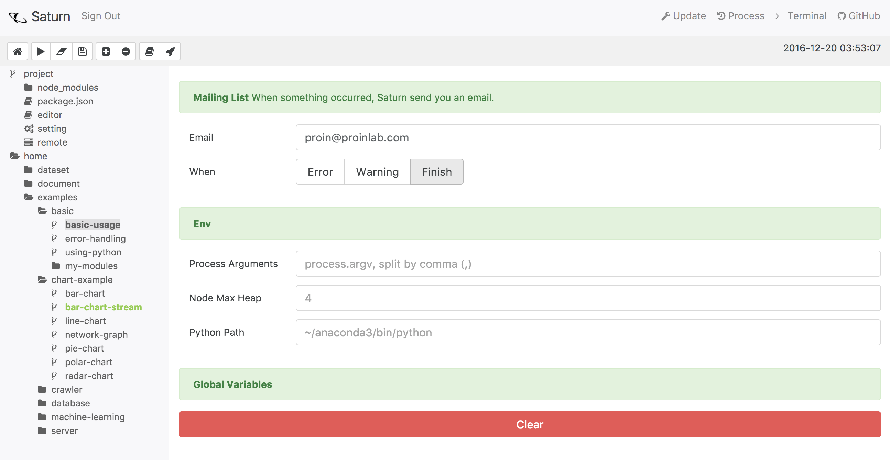
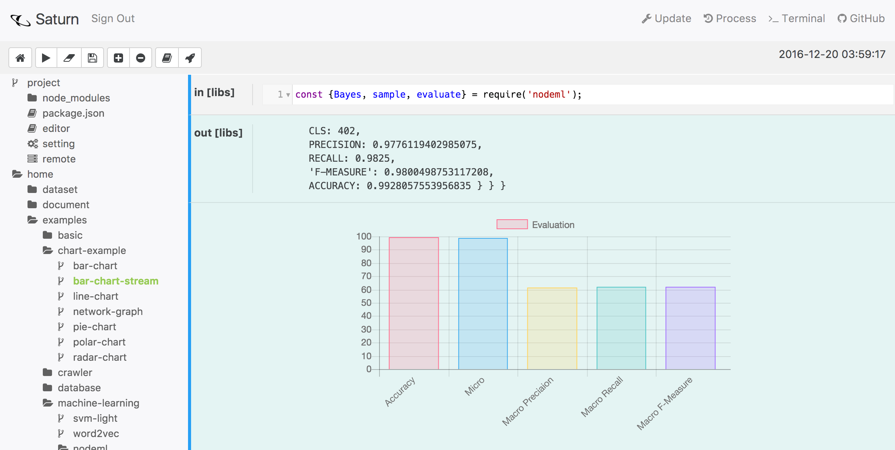
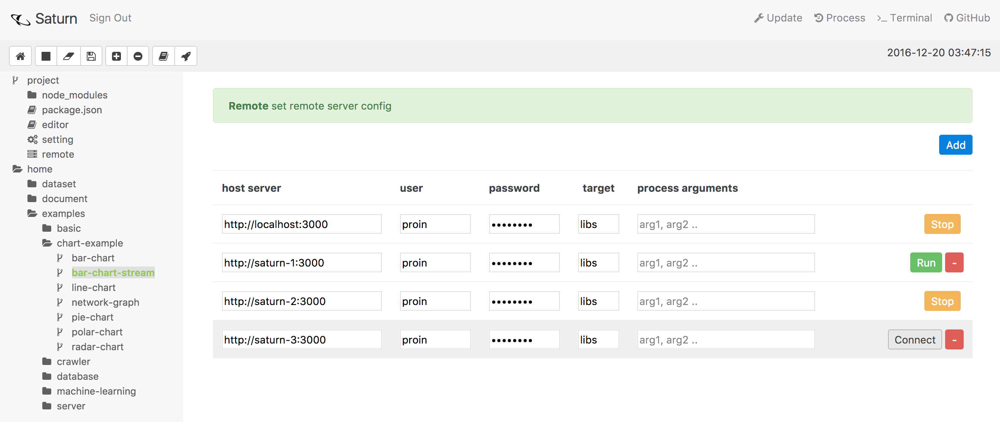
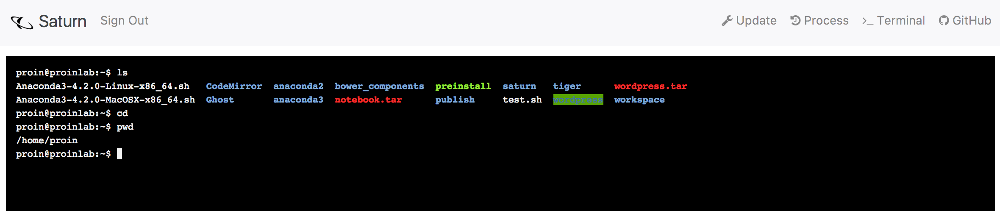

# Saturn

[](https://raw.githubusercontent.com/proin/saturn-docker/master/LICENSE)
[]()
[]()
[]()
[]()
[]()
[]()
[]()

> Saturn is opensource Machine Learning Framework.


## Features

- Support multi-language: `python`, `node`, `markdown`
- Distribution your work using `remote`
- Unit test available, even though asynchronous loop
- Mailing on event (error, finish)

### Quick Reference

- [common usage](http://saturn.proinlab.com/#/examples/basic)
- [chart demo](http://saturn.proinlab.com/#/examples/chart-example)
- [crawler demo](http://saturn.proinlab.com/#/examples/crawler)
- [machine learning](http://saturn.proinlab.com/#/examples/machine-learning)
- [web server](http://saturn.proinlab.com/#/examples/server)

### Related Projects

- [saturn](https://github.com/proin/saturn)
    - Web based GUI framework
- [saturn-core](https://github.com/proin/saturn-core)
    - Core for running and compile
    - will be update language module for supporting more languages
- [saturn-docker](https://github.com/proin/saturn-docker)
    - Docker for easy install 

---

## Installation

### Using Docker

- Installation & Run

    ```bash
    docker pull proin/saturn
    docker run -it --name saturn -v ~/workspace/saturn:/workspace -p 3000:3000 proin/saturn
    ```

- Run as Daemon

    ```bash
    docker run -d --name saturn -v ~/workspace/saturn:/workspace -p 3000:3000 proin/saturn
    docker kill saturn #if you want to kill process
    ```

- Restart

    ```bash
    docker restart saturn
    ```

- Attach Running Container

    ```bash
    docker exec -i -t saturn /bin/bash
    ```

### Build from Source

- Clone & Build

    ```bash
    npm install -g lwot
    git clone https://github.com/proin/saturn 
    cd saturn
    bower install
    cp ./controller/express/config-sample.json ./controller/express/config.json
    lwot install
    lwot build
    lwot express run
    # then started at your browser, localhost:3000
    ```

- Run as Daemon

    ```bash
    lwot express forever start # after launched, press Ctrl+C
    lwot express forever stop # stop daemon
    lwot express forever log # show logs
    ```

- Update
    - you can easily update saturn in web. just click update.
    - or run `sh update.sh` in Unix systems

### Configuration

- you can change configuration editing by `./controller/express/config.json` file

    ```js
    {
        "port": 3000, // server port to bind
        "home": "./saturn-project", // workspace home, start from USER HOME
        "dev": true, // display express log
        "log": true, // display thread log
        "hostname": "http://localhost", // direct url
        "smtp": { // emailjs configuration object
            "host": "smtp.your-site.net",
            "user": "user@your-site.net",
            "password": "password",
            "ssl": true
        },
        "mailingList": "your@mail-address.net, co-worker@mail-address.net", // who are received? 
        "mailingOn": {
            "error": true, // mail when error occured 
            "finish": true // mail when work finished
        },
        "readonly": true, // readable project for whom not signin users
        "user": "admin", // admin user
        "password": "admin123", // admin password
        "session": {
            "secret": "sAtuRN-seSsIon-sEcreT",
            "resave": false,
            "saveUninitialized": false
        },
        "MAX_LOG": 500, // display log size
        "encrypt": "sAtuRn"
    }
    ```

---
    
## Overview

### Machine Learning

- you can use machine learning libraries in `saturn`
- now `saturn` supports `python (including tensorflow)`, `R`, `torch`
- in `saturn-docker` installation, all frameworks are embedded in there.

### Code with Markdown
 
- `saturn` support markdown editor in project
- you can write down code more effectively 
 


### Mailing on Event
 
- you can receive email when the work is finished or occured warning or error
- you no longer have to wait for the job to finish
 


### Graph

- you can use graph by making structure & calling function.
- for more usage, refer [chart demo](http://saturn.proinlab.com/#/examples/chart-example)



### Remote Server

- Distribute some work using `remote` features
- you can easily distribute in `[project > remote]`



### System Terminal

- You can use system terminal where `saturn` is installed
- This allow to only `GRANTALL` user



--- 

## Future Works

- Support Machine Learning Frameworks if it is possible
    - `Torch`
    - `Caffe`
    - `R`
